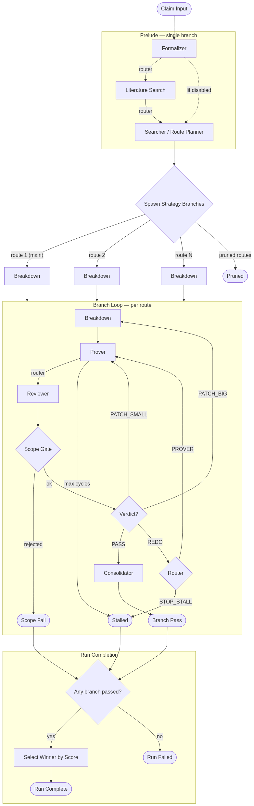
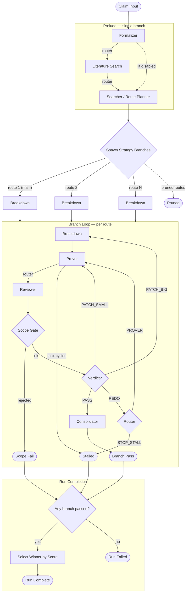
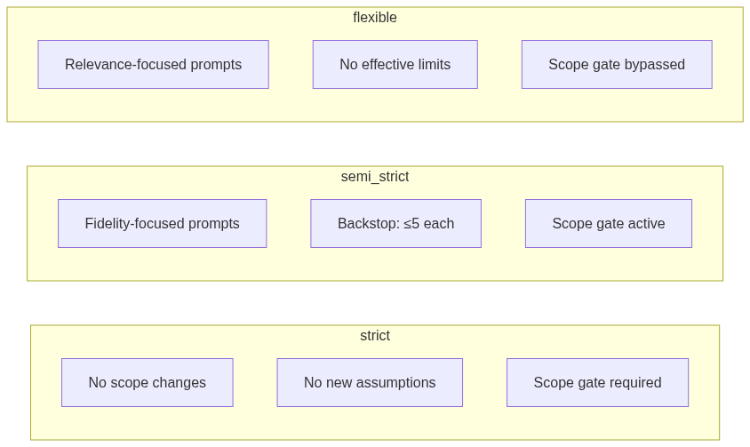
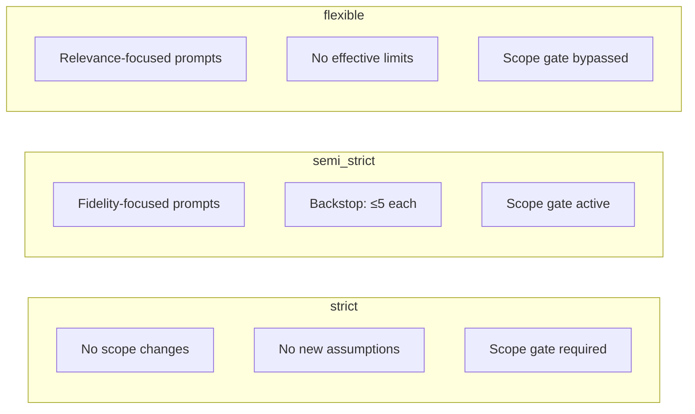
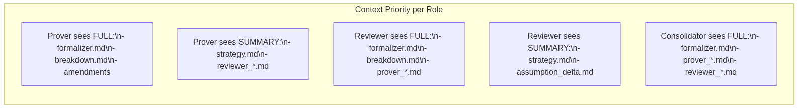
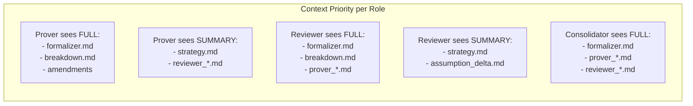

# MathPipeProver Workflow Graph

## Main Pipeline

Mermaid source

## Mode / Policy Enforcement

Mermaid source

Scope enforcement is two-layered:
1. **Prompt injection** — each role receives a scope-policy paragraph matching its mode and category (generative, evaluative, planning, consolidator). Models self-enforce.
2. **Mechanical backstop** — `_scope_decision()` counts `[SCOPE]`/`[ASSUMPTION+]` tags after each reviewer cycle and blocks the branch if limits are exceeded. In flexible mode (`require_scope_gate=False`) the gate always passes but still writes delta files for observability.

## Budget Gates

Budget checks run at the top of every phase iteration:
- **Global**: `max_total_tokens`, `max_total_calls`
- **Per-branch**: `max_tokens_per_branch`, `max_calls_per_branch`

If exceeded → branch gets `fail_budget` status. If global budget exceeded → all branches terminated.

## Role Data Flow

Mermaid source

All other files appear as **manifest only** (filename + character count).
