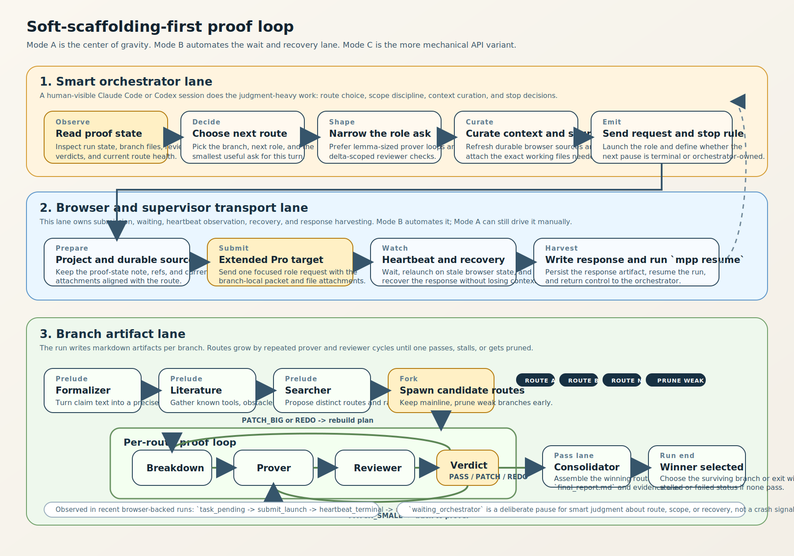
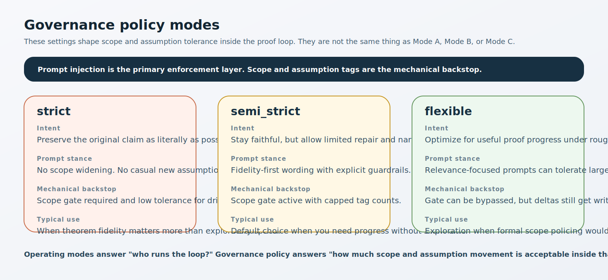
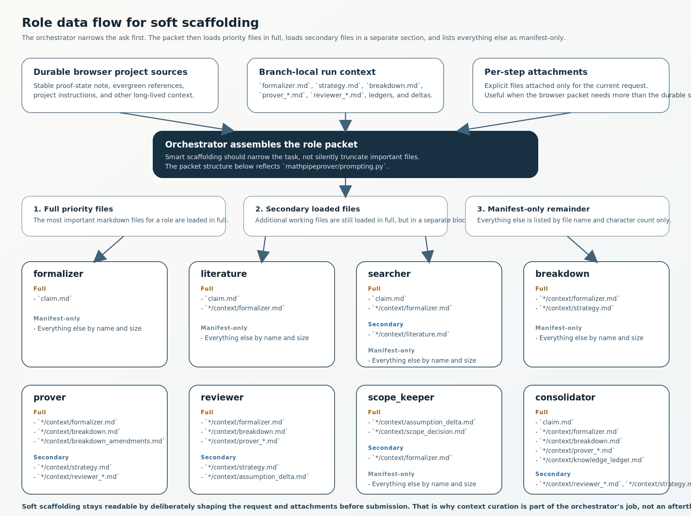

# MathPipeProver Workflow Graphs

These diagrams describe the current repo reality: a smart orchestrator runs the proof, with the browser lane handling ChatGPT submission and recovery.

## Smart-Scaffolding Loop

- The orchestrator chooses the next narrow task, curates context, and decides whether a route should continue. Every completed soft role returns control to the orchestrator.
- Branch-local context grows through repeated `breakdown -> prover -> reviewer` cycles until a branch passes, stalls, or is pruned.
- `waiting_orchestrator` is an intentional handoff for judgment, not an error state.

## Governance Policy Modes

Governance policy (`strict`, `semi_strict`, `flexible`) is separate from the repository's operating taxonomy (smart scaffolding / API pipeline). Policy modes govern scope and assumption tolerance inside the proof loop.

## Budget Gates

Budget checks run at the top of each phase iteration:

- Global: `max_total_tokens`, `max_total_calls`
- Per-branch: `max_tokens_per_branch`, `max_calls_per_branch`

If a branch exceeds its budget, it moves to `fail_budget`. If the run exceeds global budget, all remaining branches stop.

## Role Data Flow

- Durable browser project sources hold stable reference material that should survive across many role turns.
- Branch-local markdown files are the live working set for the current route.
- Literature notes can live in both layers on purpose: a stable literature memo may sit in durable sources, while the current `literature.md` should still be passed explicitly to `searcher` when route selection depends on it.
- Each role packet loads priority files in full, loads secondary files in a separate section, and lists everything else as manifest-only.
- Soft scaffolding stays sane by narrowing the task and packet on purpose rather than truncating important files.
